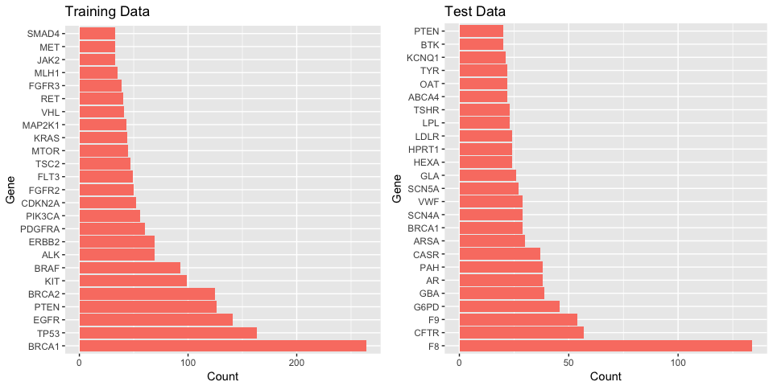
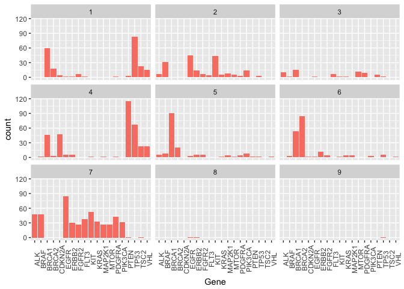
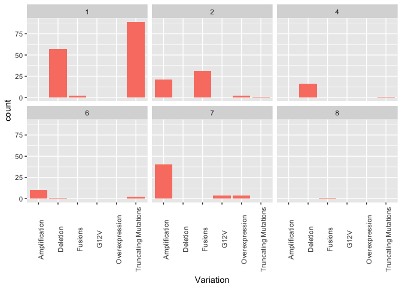
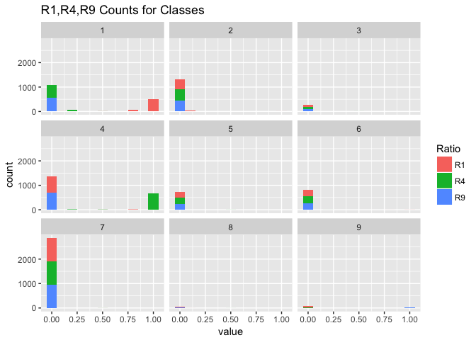
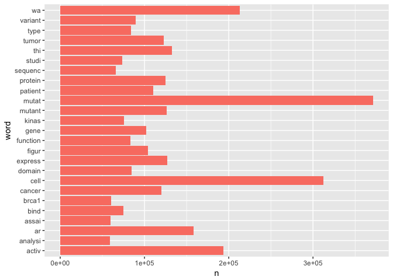

# Personalized Medicine: Exploration
In this notebook, I will just explore the data and try to get some insights on how the target variable `Class` is related to the features (extracted or engineered from the data). 


```
## 
## Attaching package: 'dplyr'
```

```
## The following objects are masked from 'package:stats':
## 
##     filter, lag
```

```
## The following objects are masked from 'package:base':
## 
##     intersect, setdiff, setequal, union
```

```
## 
## Attaching package: 'purrr'
```

```
## The following objects are masked from 'package:dplyr':
## 
##     contains, order_by
```

```
## 
## Attaching package: 'gridExtra'
```

```
## The following object is masked from 'package:dplyr':
## 
##     combine
```
We first load the variants data, which is simple:

```r
train_variants <- read_csv("./data/training_variants", progress = FALSE)
```

```
## Parsed with column specification:
## cols(
##   ID = col_integer(),
##   Gene = col_character(),
##   Variation = col_character(),
##   Class = col_integer()
## )
```

```r
test_variants <- read_csv("./data/test_variants", progress = FALSE)
```

```
## Parsed with column specification:
## cols(
##   ID = col_integer(),
##   Gene = col_character(),
##   Variation = col_character()
## )
```
Loading the text data is a little more involved. A simple call to `read_delim` was unsuccesful. So we read the data as a simple text and then split into a data frame as follows:

```r
# train
train_text <- read_lines("./data/training_text", skip=1)
train_text_df <- str_split_fixed(train_text, pattern = "\\|\\|", n = 2) %>% tbl_df()
colnames(train_text_df) <- c("ID", "Text")
train_text_df <- train_text_df %>% mutate(ID = as.integer(ID))
# test
test_text <- read_lines("./data/test_text", skip=1)
test_text_df <- str_split_fixed(test_text, pattern = "\\|\\|", n = 2) %>% tbl_df()
colnames(test_text_df) <- c("ID", "Text")
test_text_df <- test_text_df %>% mutate(ID = as.integer(ID))
```

```
##            used  (Mb) gc trigger   (Mb)  max used  (Mb)
## Ncells  1454877  77.7    2637877  140.9   1770749  94.6
## Vcells 58816590 448.8  142201478 1085.0 125566456 958.0
```

### Variants data

Let's look at how `Class` is distributed in training data (this is the target):

```r
train_variants %>%
  group_by(Class) %>%
  count(Class,sort=TRUE)
```

```
## # A tibble: 9 × 2
##   Class     n
##   <int> <int>
## 1     7   953
## 2     4   686
## 3     1   568
## 4     2   452
## 5     6   275
## 6     5   242
## 7     3    89
## 8     9    37
## 9     8    19
```
Clearly, there is an inbalance in the class labels, which we need to be aware of. 

#### Gene
Let's look at how `Gene` feature is distributed. The top 25 most common genes for training/test data are:

```r
df0 <- train_variants %>% 
  group_by(Gene) %>%
  count(Gene,sort=TRUE) %>% 
  slice(1:25)

df00 <- test_variants %>%
  group_by(Gene) %>%
  count(Gene,sort=TRUE) %>%
  slice(1:25)
```


```r
gg0 <- ggplot(df0, aes(reorder(Gene, -n, FUN=min), n)) + 
  geom_bar(stat="identity", fill = "salmon") + 
  coord_flip() + 
  labs(x = "Gene", y = "Count") + ggtitle('Training Data')

gg00 <- ggplot(df00, aes(reorder(Gene, -n, FUN=min), n)) + 
  geom_bar(stat="identity", fill = "salmon") + 
  coord_flip() + 
  labs(x = "Gene", y = "Count") + ggtitle('Test Data')

grid.arrange(gg0, gg00, ncol=2)
```

<!-- -->
Clearly, there is rather a different distribution of top Genes in training and test data.

```r
intersect(df0$Gene, df00$Gene)
```

```
## [1] "BRCA1" "PTEN"
```
This is probably due to the artificial data generated in the test set to avoid hand labelling.

How is `Gene` related to Class (outcome)

```r
top_genes <- df0 %>% filter(n > 40)
df1 <- train_variants %>%
  filter(Gene %in% top_genes$Gene) %>%
  group_by(Gene,Class) %>%
  summarise(count = n()) 

gg1 <- ggplot(df1, aes(Gene,count)) + 
  geom_bar(stat = 'identity', fill='salmon') + 
  theme(axis.text.x  = element_text(angle=90)) +
  facet_wrap(~Class)
gg1
```

<!-- -->

#### Variation
How does `Variation` is distributed? 

```r
df1 <- train_variants %>% 
  group_by(Variation) %>%
  count(Variation, sort=TRUE) %>%
  mutate(is.train = TRUE) 


df11 <- test_variants %>% 
  group_by(Variation) %>%
  count(Variation, sort=TRUE) %>%
  mutate(is.train = FALSE)


df111 <- full_join(df1, df11, by = c("Variation", "n", "is.train"))
df111[is.na(df111)] <- 0
df111 %>% top_n(8, n) 
```

```
## # A tibble: 8 × 3
##              Variation     n is.train
##                  <chr> <int>    <lgl>
## 1 Truncating Mutations    93     TRUE
## 2             Deletion    74     TRUE
## 3        Amplification    71     TRUE
## 4              Fusions    34     TRUE
## 5       Overexpression     6     TRUE
## 6 Truncating Mutations    18    FALSE
## 7             Deletion    14    FALSE
## 8        Amplification     8    FALSE
```
There are so many unique values to `Variation`, and most of them are observed once.

How is `Variation` is related to clas?

```r
top_variations <- df111 %>% filter(n > 3)
df2 <- train_variants %>%
  filter(Variation %in% top_variations$Variation) %>%
  group_by(Variation,Class) %>%
  summarise(count = n()) 

gg2 <- ggplot(df2, aes(Variation,count)) + 
  geom_bar(stat = 'identity', fill='salmon') + 
  theme(axis.text.x  = element_text(angle=90)) +
  facet_wrap(~Class)
gg2
```

<!-- -->
Truncating mutations seem to have a large correlation with Class = 1. None of the top variations has any knowledge of Class 3,4,9.

### Ratio features
Let's engineer ratio features (`n_Variatiob_Class`/`n_Variation`) using 5 folds. See documentation for details. 

```r
source('create_ratio_features.R')
```

```
## Loading required package: lattice
```

```
## 
## Attaching package: 'caret'
```

```
## The following object is masked from 'package:purrr':
## 
##     lift
```

```r
train_new <- create_ratios_folds(train_variants, 5)
names(train_new) <- c("ID", "Gene", "Variation", "Class", paste0("R",1:9))
```
Let's look at this data

```r
train_new
```

```
## # A tibble: 3,321 × 13
##       ID   Gene            Variation Class        R1         R2    R3
##    <dbl>  <chr>                <chr> <dbl>     <dbl>      <dbl> <dbl>
## 1      0 FAM58A Truncating Mutations     1 0.9569892 0.01075269     0
## 2      5    CBL                V391I     4 0.0000000 0.00000000     0
## 3      6    CBL                V430M     5 0.0000000 0.00000000     0
## 4     13    CBL                C381A     4 0.0000000 0.00000000     0
## 5     16    CBL Truncating Mutations     1 0.9569892 0.01075269     0
## 6     17    CBL                Q367P     4 0.0000000 0.00000000     0
## 7     21    CBL                C396R     4 0.0000000 0.00000000     0
## 8     29   TERT                H412Y     4 0.0000000 0.00000000     0
## 9     36 DICER1               G1809K     4 0.0000000 0.00000000     0
## 10    41 DICER1 Truncating Mutations     1 0.9569892 0.01075269     0
## # ... with 3,311 more rows, and 6 more variables: R4 <dbl>, R5 <dbl>,
## #   R6 <dbl>, R7 <dbl>, R8 <dbl>, R9 <dbl>
```
How does the new ratio features (`R1`,.., `R9`) correlate with Class?

```r
gg3 <- ggplot(train_new %>% gather(key = "Ratio", value = "value", -c(ID,Gene,Variation,Class)) %>% 
                mutate(Ratio = as.factor(Ratio)) %>%
                mutate(Class = as.factor(Class)) %>%
                filter(Ratio %in% c("R1","R4", "R9")), 
              aes(value)) + 
  geom_histogram(aes(fill = Ratio), binwidth = 0.1) + 
  facet_wrap(~Class) + 
  ggtitle("R1,R4,R9 Counts for Classes")
gg3
```

<!-- -->
Clearly, these ratio features correlate better with the Class they represent.

### Text data

```
##            used  (Mb) gc trigger   (Mb)  max used  (Mb)
## Ncells  1838633  98.2    3205452  171.2   2637877 140.9
## Vcells 59184041 451.6  142201478 1085.0 125566456 958.0
```
Now let's tokenize train

```r
train_txt <- train_text_df %>% unnest_tokens(word, Text)
```
Most common words

```r
train_txt %>% count(word, sort=TRUE) %>% slice(1:10)
```

```
## # A tibble: 10 × 2
##     word       n
##    <chr>   <int>
## 1    the 1518173
## 2     of 1248592
## 3    and  937983
## 4     in  919745
## 5     to  568644
## 6      a  474773
## 7   with  390270
## 8   that  291439
## 9    for  277178
## 10  were  261897
```
These are stop words that we can remove. 


```r
library(SnowballC)
data("stop_words")
# Extra words that can be removed which we add by hand
my_stopwords <- data_frame(word = c(as.character(1:100),
                                    "fig", "figure", "et", "al", "table",
                                    "data", "analysis", "analyze", "study",
                                    "method", "result", "conclusion", "author",
                                    "find", "found", "show", "perform",
                                    "demonstrate", "evaluate", "discuss"))
train_txt <- train_txt %>% mutate(word = wordStem(word))
train_txt <- train_txt %>%
  anti_join(stop_words, by = 'word') %>%
  anti_join(my_stopwords, by = 'word') %>%
  filter(str_detect(word, "[:alpha:]")) # No numbers
```

```r
train_txt %>% count(word, sort=TRUE) %>% slice(1:20)
```

```
## # A tibble: 20 × 2
##        word      n
##       <chr>  <int>
## 1     mutat 371333
## 2      cell 312173
## 3        wa 213318
## 4     activ 193396
## 5        ar 158295
## 6       thi 132731
## 7   express 126824
## 8    mutant 126531
## 9   protein 124885
## 10    tumor 122939
## 11   cancer 120137
## 12  patient 110230
## 13    figur 104176
## 14     gene 102089
## 15  variant  89885
## 16   domain  84753
## 17     type  83834
## 18 function  83381
## 19    kinas  75972
## 20     bind  74838
```
Let's visualize

```r
gg4 <- ggplot(train_txt %>% count(word, sort=TRUE) %>% slice(1:25), aes(word,n)) + 
  geom_bar(stat="identity", fill='salmon') + 
  coord_flip()
gg4
```

<!-- -->
Use term frequency-inverse document frequency (tf-idf) function. 
First, treat "Class" as "Document" of td-idf: 

```r
foo <- train_variants %>% select(ID, Class)
txt_class <- full_join(train_txt, foo, by = "ID")

frequency <-txt_class %>%
  count(Class, word)

tf_idf <- frequency %>%
  bind_tf_idf(word, Class, n)
```

```r
tf_idf %>% filter(tf_idf > 1e-3)
```

```
## Source: local data frame [20 x 6]
## Groups: Class [3]
## 
##    Class      word     n           tf       idf      tf_idf
##    <int>     <chr> <int>        <dbl>     <dbl>       <dbl>
## 1      3     r834q   266 0.0007502531 1.5040774 0.001128439
## 2      8       2hg   376 0.0030257673 0.5877867 0.001778506
## 3      8    dnmt3b   216 0.0017382068 0.5877867 0.001021695
## 4      8   dnmt3b7   325 0.0026153574 2.1972246 0.005746528
## 5      8     h3f3a   170 0.0013680331 0.8109302 0.001109379
## 6      8 her2l869r    70 0.0005633077 2.1972246 0.001237714
## 7      8       k42   147 0.0011829463 2.1972246 0.002599199
## 8      8      k42a   291 0.0023417508 2.1972246 0.005145352
## 9      8    k42me2    72 0.0005794023 2.1972246 0.001273077
## 10     8    zc3h7b    74 0.0005954968 2.1972246 0.001308440
## 11     9       2hg  1398 0.0048346267 0.5877867 0.002841729
## 12     9 ezh2y641f   272 0.0009406427 2.1972246 0.002066803
## 13     9      idh2  1262 0.0043643054 0.2513144 0.001096813
## 14     9       s34   135 0.0004668631 2.1972246 0.001025803
## 15     9      s34f   581 0.0020092404 0.8109302 0.001629354
## 16     9     sf3b1  2763 0.0095551313 0.2513144 0.002401342
## 17     9  sf3b1mut   500 0.0017291226 1.5040774 0.002600734
## 18     9   sf3b1wt   306 0.0010582230 1.0986123 0.001162577
## 19     9    u2af35   499 0.0017256643 1.5040774 0.002595533
## 20     9      y641   271 0.0009371844 2.1972246 0.002059205
```
This gives us a subset of words that are correlated with class labels.

In the standard td-idf approach, the "Document" should be `ID`. Let's try that as well:

```r
foo <- train_variants %>% select(ID, Class)
txt_class <- full_join(train_txt, foo, by = "ID")

frequency <-txt_class %>%
  count(ID, word, sort=TRUE) %>%
  slice(1:5000) # Keep only the first 5000 most frequent words

tf_idf <- frequency %>%
  bind_tf_idf(word, ID, n)
```

```
## Warning in tbl[[n_col]]/as.numeric(doc_totals[documents]): longer object
## length is not a multiple of shorter object length
```

```r
tf_idf %>% filter(tf_idf > 1e-3)
```

```
## Source: local data frame [1,172,863 x 6]
## Groups: ID [3,318]
## 
##       ID     word     n          tf        idf      tf_idf
##    <int>    <chr> <int>       <dbl>      <dbl>       <dbl>
## 1      0    cdk10   128 0.035734227 7.41487404 0.264964790
## 2      0   cyclin   125 0.034896706 1.56988140 0.054783689
## 3      0     ets2    70 0.019542155 5.06349878 0.098951679
## 4      0    level    49 0.013679509 0.07533635 0.001030564
## 5      0   fam58a    34 0.009491904 7.41487404 0.070381272
## 6      0     star    33 0.009212730 2.68307120 0.024718411
## 7      0 interact    28 0.007816862 0.22570630 0.001764315
## 8      0       mm    26 0.007258515 0.68325946 0.004959449
## 9      0  syndrom    25 0.006979341 0.81160795 0.005664489
## 10     0   silenc    23 0.006420994 1.83892494 0.011807726
## # ... with 1,172,853 more rows
```
I'm not sure why we get the above warning, but the function seem to work. Looks like treating `Class` as document seems like a better idea.
